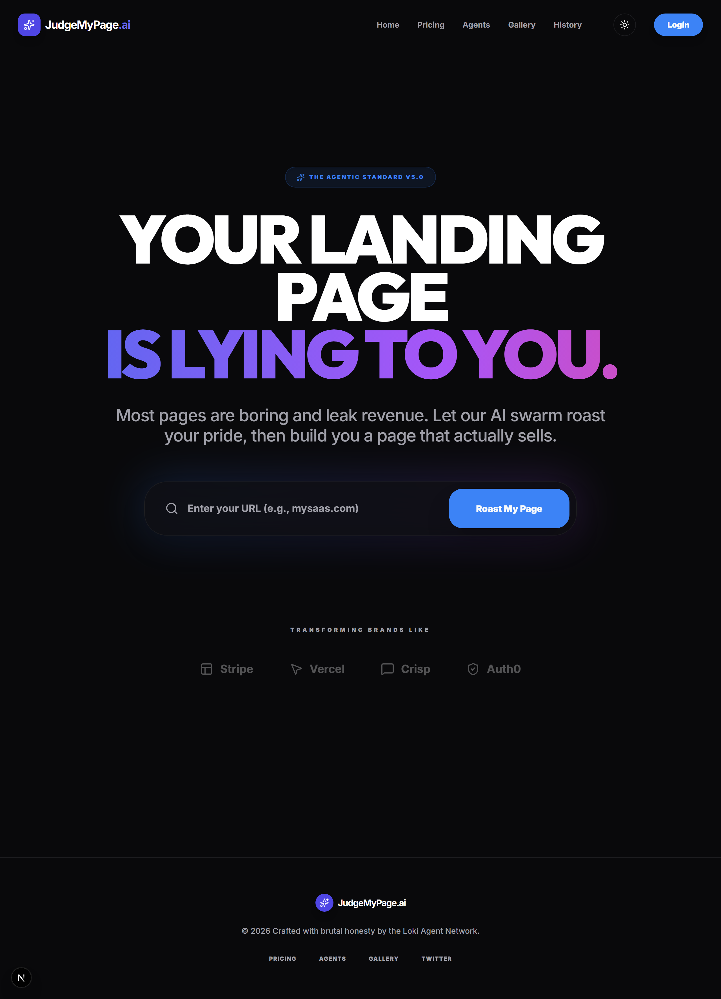
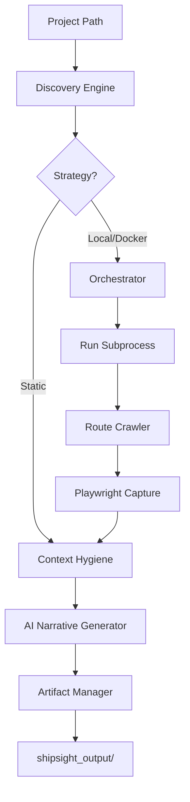

# ShipSight 🚢

**Turn your running projects into high-quality public proof.**

ShipSight is an autonomous "Showcase Engine" for software builders. It doesn't just generate a README; it runs your app, crawls your routes, captures high-res visual proof, and crafts a technical narrative from the **Creator's Perspective**.

---

## 🚀 One-Command Start

ShipSight is designed to be zero-config. Our runner scripts handle the environment, dependencies, and execution automatically.

### Windows (PowerShell)
```powershell
.\shipsight.ps1 run "C:\path\to\your\project"
```

### Linux / macOS (Shell)
```bash
./shipsight.sh run "/path/to/your/project"
```

---

## 📸 Visual Proof

ShipSight captures your hard work exactly as it looks.

### Automated App Screenshots
Capture every route in high resolution (2x) automatically.


*Next.js Application with multiple discovered routes*

### Beautiful Code Snapshots
Present your logic with vibrant, macOS-style window borders.

````carousel

<!-- slide -->

````

---

## 🧩 How it Works



1.  **Discovery**: ShipSight identifies your stack (Node, Python, Flutter, Docker) and configuration.
2.  **Orchestration**: It starts your app locally or via Docker and waits for port readiness.
3.  **Capture**: It crawls your app to discover routes and takes high-resolution screenshots.
4.  **Intelligence**: It scans your code, extracts "Hero" snippets, and cleanses the context (ignoring junk).
5.  **Output**: It generates a professional README, LinkedIn post, and beautiful code snapshots.

---

## ⚙️ Configuration Reference

ShipSight works out of the box, but you can control every aspect via `shipsight.yml` in your project root.

### Full `shipsight.yml` Example
```yaml
# Execution Settings
run:
  strategy: local      # options: local, docker, static
  port: 3000           # the port your app runs on (auto-detected if omitted)
  command: npm run dev # custom startup command

# Visual Capture Settings
capture:
  routes:              # specific routes to capture
    - /
    - /pricing
    - /dashboard
  auth_enabled: false   # set to true if app requires login (upcoming)
  viewport:
    width: 1280
    height: 720

# Output Customization
output:
  path: shipsight_output
  formats: ["readme", "linkedin"]
  anonymize: false      # wipe sensitive strings (upcoming)

# AI & Narrative Settings
ai:
  provider: openai      # options: openai, anthropic, groq, ollama
  model: gpt-4o-mini    # or claude-3-5-sonnet, llama-3.1-8b-instant
```

---

## 🔐 API Key Setup

ShipSight needs at least one AI provider to write your narratives. We recommend using a `.env` file in the ShipSight folder.

1.  **Create `.env`**: `cp .env.example .env`
2.  **Add your keys**:
    - `OPENAI_API_KEY=sk-...` (Auto-switches to GPT-4o mini)
    - `ANTHROPIC_API_KEY=sk-...` (Auto-switches to Claude 3.5 Sonnet)
    - `GROQ_API_KEY=gsk-...` (Auto-switches to Llama 3.1 8B)

**Loki-Mode Intelligence**: ShipSight's "Smart Detection" automatically picks the best provider based on the keys it finds in your environment.

---

## 🛠️ Advanced Manual Setup

If you prefer to manage the environment yourself:

1.  **Clone & Install**:
    ```bash
    git clone https://github.com/shipsight/shipsight.git
    cd shipsight
    python -m venv .venv
    source .venv/bin/activate # Windows: .venv\Scripts\activate
    pip install -e .
    playwright install chromium
    ```
2.  **Run**:
    ```bash
    shipsight run "C:\MyProject"
    ```

---

## 🤝 Key Principles

*   **Context Hygiene**: We never send your `node_modules`, `.git`, or `.skills` to the AI. Only the code that matters.
*   **Anti-Hype Guardrails**: Our narratives are written for developers. No "game-changing" fluff. Just features and stack details.
*   **Static Fallback**: If your app fails to start, we don't give up. ShipSight switches to "Static Mode" to analyze your code structure and still give you great docs.

---

**Built with ❤️ for those who ship.**
